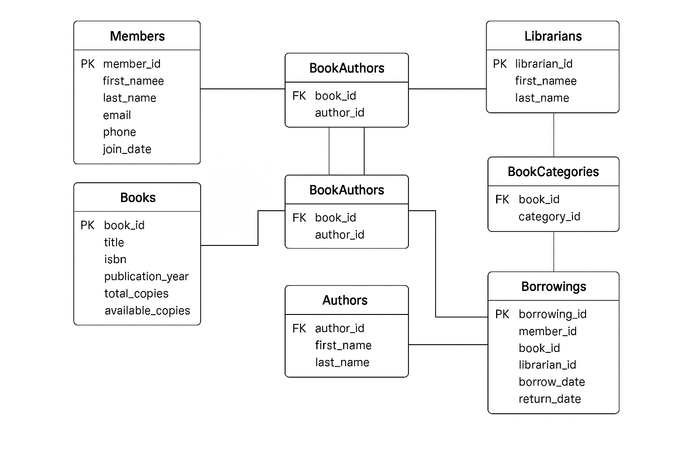

# Library-Management-DBMS-week-8
Design and implement a full-featured database using only MySQL.

# 📚 Library Management System

## 📖 Project Description
The **Library Management System** is a MySQL-based relational database designed to efficiently manage library resources. It tracks books, members, borrowing activities, book authors, categories, and the librarians who manage transactions.

This database supports:
- Member registration and tracking
- Book inventory with authors and categories
- Borrowing and returning of books
- Librarian accountability
- Many-to-many relationships (Books ↔ Authors, Books ↔ Categories)

## 🛠️ Setup Instructions

### Requirements:
- MySQL installed (e.g., MySQL Server or MySQL Workbench)

### To Run:
1. Open your MySQL client (like MySQL Workbench).
2. Create a new database (e.g., `CREATE DATABASE library_db;`).
3. Select the database: `USE library_db;`
4. Copy and paste the contents of the `.sql` file into the SQL editor.
5. Execute the SQL script to create all tables and relationships.

That's it! Your database is now ready for use.

## 🧩 Entity Relationship Diagram (ERD)

Here is a simplified ERD showing the relationships between tables:

*If image does not load, you can [view it directly here](https://i.imgur.com/9jJWa2Z.png).*

- MySQL Workbench (Model tab)

---

## ✅ Example Tables Overview:

- **Members** – Info about people borrowing books
- **Books** – Library books with inventory tracking
- **Authors** – Linked to books via `BookAuthors`
- **Categories** – Linked to books via `BookCategories`
- **Borrowings** – Tracks when members borrow books
- **Librarians** – Handles the check-in/out process

---

Created as part of a SQL Database Design assignment.  
